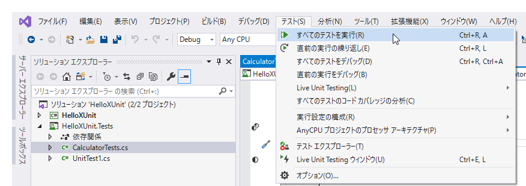
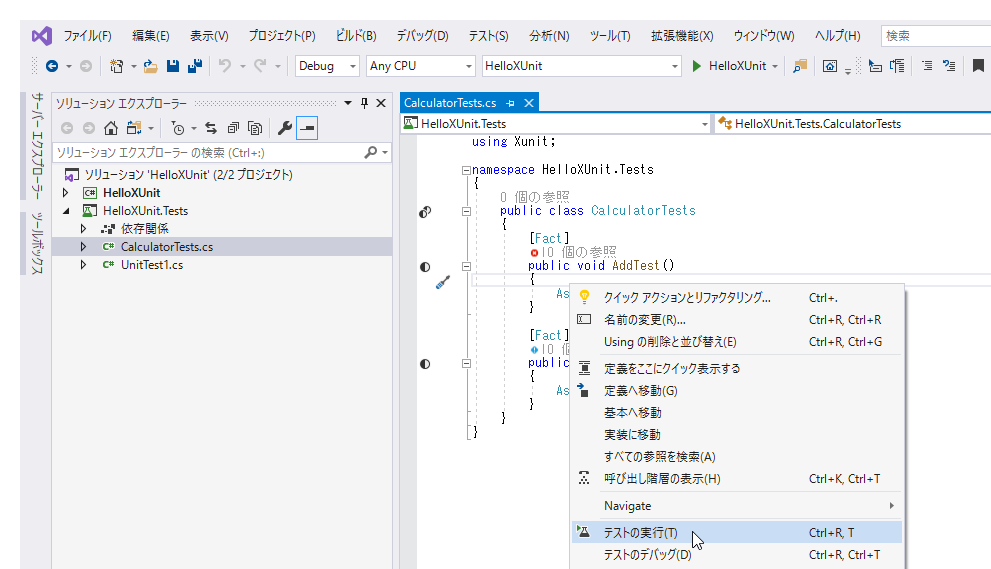

# Visual Studio 2019のテストの実行方法

つぎのいずれかかからテストを実行します。

- 「テスト」メニューから実行
- テスト対象を右クリックし、コンテキストメニューから実行

## 「テスト」メニューから実行

ソリューション内のすべてのテストを実行したい場合に利用します。

## テスト対象を右クリックし、コンテキストメニューから実行

つぎのような箇所を選択・右クリックして表示されたコンテキストメニューから実行します。

- ソリューションエクスプローラーのソリューション
- ソリューションエクスプローラーのプロジェクト
- ソリューションエクスプローラーのテストコードファイル
- コードエディター内のクラスの領域（メソッドの外の部分）
- コードエディター内のメソッドの領域

それぞれの選択された箇所のテストが実行されます。

