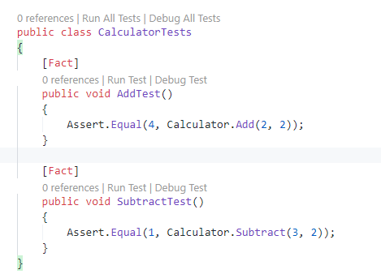

# Visual Studio 2019のテストの実行方法

つぎのいずれかかからテストを実行します。

- コンソールからdotnetコマンドで実行
- テキストエディター上から実行

## コンソールからdotnetコマンドで実行

以下のコマンドで実行します。

```console
> dotnet test
```

## テキストエディター上から実行

クラスやメソッドの宣言上に「Run All Tests」「Debug All Tests」「Run Test」「Debug Test」が表示されているはずです。

それをクリックすることで実行します。



結果は「出力」タブに表示されます。